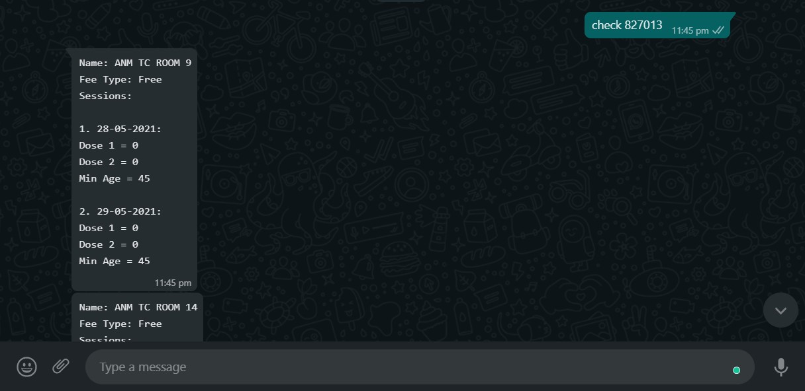
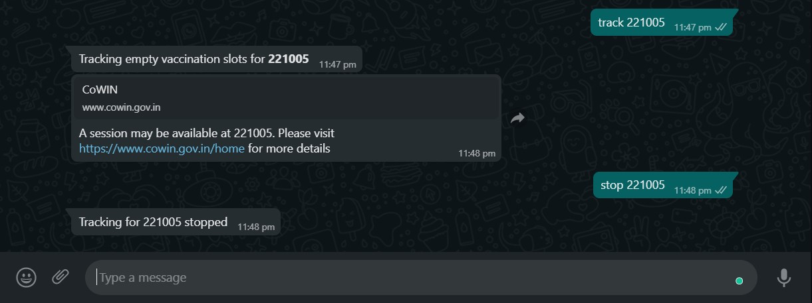

<h1 align="center">CoWINbot 🤖</h1>

<h4 align="center">A minimal WhatsApp bot for checking & tracking empty vaccination slots</h4>

<h1 align="center">Usage</h1>

### Set Up
- [Click on this link](https://wa.me/+14155238886?text=join%20think-themselves). This will open up WhatsApp on your mobile / PC.
- The invitation text has already been filled into the message box, just send the message, and you are in! 🎉.

### Checking empty slots
- Send `check <pincode>` to get availability info for all the centers available at the `<pincode>`
- Example : Check slots for 827013 --> `check 827013`

    
### Tracking empty slots
- Send `track <pincode>` and the bot will schedule a scan for your pincode every 30 minutes.
- If you wish to stop tracking for `<pincode>`, just send `stop <pincode>`.
- Example : 
  - Track slots for 827013 --> `track 827013`
  - Stop tracking for 827013 --> `stop 827013`
  

### Keep in mind
Due to geo-fencing issue of the CoWIN API, this bot has not been deployed. However, you are free to clone this repo, make changes and deploy your own instance. If this helps you, don;t shy away from starring this repo.

All contributions and issues are welcome 🤗.
